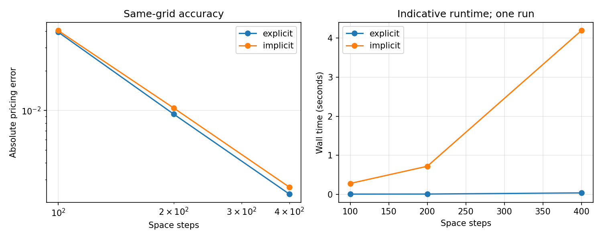

# Quantitative finance & applied mathematics portfolio

[Français](README.fr.md)

Academic Python projects covering option pricing, stochastic simulation and statistical privacy. The numerical outputs below are reproducible examples, not a claim of production readiness.

| Project | Methods and evidence | Explore |
| --- | --- | --- |
| **European option pricing** | Explicit/implicit finite differences, Thomas solver, analytical Black–Scholes benchmark, grid refinement and domain sensitivity | [Code, results and assumptions](black_scholes_fd/) |
| **Stochastic differential equations** | Euler–Maruyama and Milstein against exact GBM; coupled Brownian paths, Monte Carlo uncertainty, square-root diffusion | [Code, figures and PDF report](equations_stochastiques/) |
| **Differential privacy** | Laplace/Gaussian teaching simulator, fixed-size replacement adjacency, equal-prior distinction experiment | [Application, experiment and limitations](confidentialite_differentielle/) |

## Selected numerical results

**Pricing:** European call, S = K = 100, r = 5%, volatility = 20%, maturity = 1 year, Smax = 400. Both schemes use 200 space steps and 2,000 time steps.

| Method | Price | Absolute error |
| --- | ---: | ---: |
| Analytical Black–Scholes | 10.450584 | — |
| Explicit finite differences | 10.441212 | 0.009372 |
| Implicit finite differences | 10.440159 | 0.010425 |



**Stochastic simulation:** terminal strong L1 convergence on a GBM (mu = 2, volatility = 1, x0 = 1, T = 1), seed 42, 5,000 paths. Empirical slopes fitted to the finest four grids: **Euler 0.523; Milstein 0.988**. These are fitted estimates, not proofs of convergence orders.


## Reproduce

Reference environment: **Python 3.12**, NumPy 2.3.5, Matplotlib 3.10.8. CI is configured for Python 3.11 and 3.12. Create an isolated environment:

```bash
python -m venv .venv
# macOS/Linux
source .venv/bin/activate
# Windows PowerShell: .venv\Scripts\Activate.ps1
python -m pip install -r requirements.txt
python -m unittest discover -s tests -v
```

Each folder includes its own instructions. Numerical experiment scripts save plots and CSV files without requiring a graphical desktop. The Tkinter application requires Python with Tk support and a graphical session.

## Scope and attribution

The pricing example covers European calls without dividends and constant market parameters. The stochastic report preserves its original group attribution (Ndeye Amy Diop, Néné Konte and Ndèye Sira Ndiaye); it should not be read as a claim of sole authorship. The differential-privacy project originates from a research internship; its original report is supplied separately from the updated prototype.

The DP application displays exact and noisy statistics for teaching: it is **not a private data-release service**, does not account for composed releases, and its distribution diagnostic does not certify privacy. Numerical boundary corrections for square-root SDEs also retain finite-step bias.

[Changes and validation](CHANGELOG.md) · [French overview](README.fr.md)
