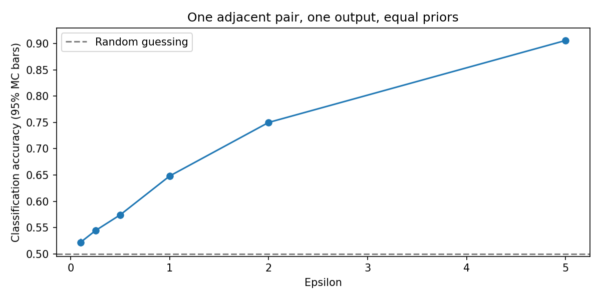

# Simulateur pédagogique de confidentialité différentielle

[English](README.md) · [Rapport de stage d'origine](rapport_stage.pdf)

Application Python/Tkinter et expérience reproductible sur données synthétiques. Les valeurs exactes sont affichées à des fins pédagogiques : ce logiciel n'est pas un service de publication de données privées.

```bash
python -m pip install -r requirements.txt
python app.py
# Expérience reproductible sans interface graphique :
python experiment.py
```

Depuis ce dossier, Python 3.11+ avec Tkinter pour l'application ; environnement local : Python 3.12. Les CSV doivent contenir des nombres finis, en une dimension, sans en-tête. Aucun transfert de CSV n'est effectué.

## Convention corrigée

Deux bases sont adjacentes lorsqu'une ligne est **remplacée**, sans changer leur taille publique n. Les bornes de clipping et le seuil du comptage sont publics et fixés avant la requête. Les données sont écrêtées avant le calcul.

| Statistique | Sensibilité |
| --- | --- |
| Moyenne | (borne haute − borne basse) / n |
| Somme | borne haute − borne basse |
| Comptage à seuil fixe | 1 |

L'attaque remplace la première ligne par une borne de clipping. Elle étudie une paire de bases, sans couvrir toutes les paires possibles.

Laplace utilise une échelle Δ/ε avec ε > 0 fini. La calibration gaussienne classique est restreinte à **0 < ε < 1 et 0 < δ < 1**. Les paramètres invalides sont rejetés. Un σ manuel n'associe pas automatiquement une garantie de confidentialité.

## Diagnostic et limites

L'ancien test d'un rapport de densités en un point est remplacé par une classification des sorties selon les vraisemblances des deux bases connues, avec probabilités a priori égales. Le taux de bonnes décisions et son intervalle Monte-Carlo approximatif à 95 % décrivent une expérience, **pas une vérification de garantie DP**.

Le diagnostic utilise les paramètres actuels, y compris σ manuel. Aucune comptabilité de composition n'est effectuée ; plusieurs sorties nécessitent une analyse supplémentaire. Le générateur NumPy n'est pas destiné à un service DP durci.



[Tableau de résultats](results/distinction.csv) : graine 42, moyenne des salaires synthétiques, bornes [0,100000], 10 000 simulations par hypothèse.

Le rapport PDF est conservé dans sa version de stage d'origine. Il ne documente pas toutes les corrections ultérieures du prototype ; le README et le code actuels décrivent la version corrigée.
