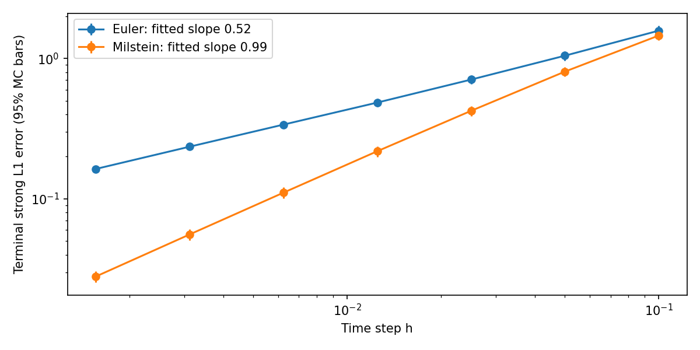
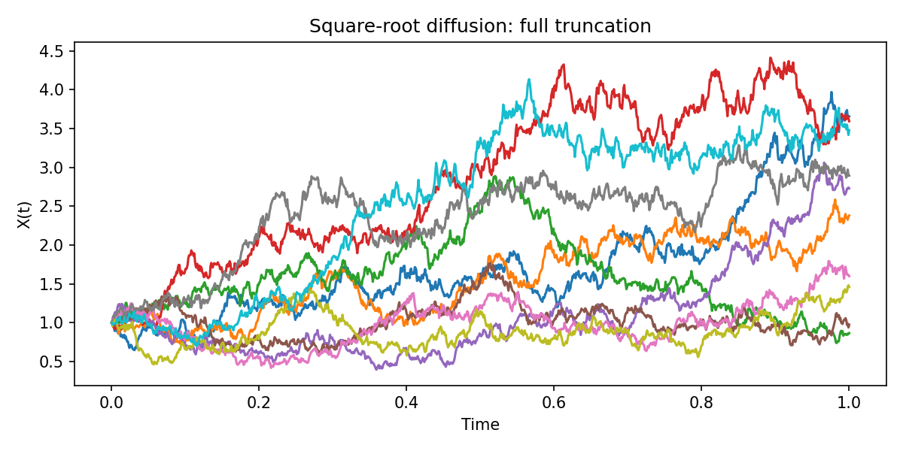

# Stochastic differential equations: simulation and convergence

[Français](README.fr.md) · [PDF report](rapport.pdf) · [LaTeX source](rapport.tex)

Academic work on Brownian paths, Euler–Maruyama, Milstein, square-root diffusion and the small-noise limit. The original report credits **Ndeye Amy Diop, Néné Konte and Ndèye Sira Ndiaye**, supervised by Clément Foucart. The numerical section and figures have been updated to match the corrected implementation; the theoretical sections are retained, without a claim of a complete new proof review.

## Reproduce

From this folder, Python 3.11+ (reference environment: Python 3.12):

```bash
python -m pip install -r requirements.txt
python code_PNI.py --seed 42 --paths 5000 --output results
```

No graphical desktop is needed. Importing `simulation.py` or `code_PNI.py` does not run experiments. `simulation.py` contains reusable, vectorized functions; `code_PNI.py` orchestrates experiments and saves PNG/CSV/JSON outputs. A seed makes results repeatable within the reference environment; results may differ across library versions.

## Euler versus Milstein

GBM: dX = mu X dt + sigma X dW, mu = 2, sigma = 1, x0 = 1, T = 1. Exact solution: X(T) = x0 exp((mu − sigma²/2)T + sigma W(T)). All grids and schemes share the same finest Brownian increments.

The metric is terminal **strong L1 error**, the Monte Carlo mean of |Xexact(T) − Xapprox(T)|. With seed 42 and 5,000 paths, slopes fitted to the finest four grids are **0.523 for Euler** and **0.988 for Milstein**. The theoretical orders require appropriate assumptions; fitted slopes alone are not a proof.



[Errors and Monte Carlo standard errors](results/convergence.csv) · [Parameters and fitted slopes](results/summary.json). Plot bars show approximate 95% intervals for error means; they are not confidence intervals for fitted slopes. Grid errors are correlated because paths are coupled.

## Square-root diffusion

The former positive semi-implicit quadratic update was removed because it introduced spurious drift. The corrected mode uses **full-truncation Euler**: retain signed internal state Y, evaluate coefficients at max(Y,0), and display max(Y,0). This is still a biased finite-step approximation; nonnegative displayed paths do not establish exactness. A regression test checks the mean on dX = sqrt(X) dW.



The reflection example uses a constant drift and an absolute-value Euler correction. It is **not the mean-reverting financial CIR model** and does not establish convergence to a reflected SDE.

## Small-noise experiment

The ODE reference is exact exp(−t); errors are discrete-grid pathwise maxima over 1,000 steps and 1,000 paths. Shared Brownian draws isolate changes in noise amplitude. [Results](results/small_noise.csv) include Monte Carlo standard errors. A fixed-grid discretization error remains as noise decreases.

## Report and historical interface

The original authors remain credited. The report's numerical discussion now matches the current experiments. The interface screenshot is historical; its Windows executable and GUI source are not distributed here.

Reference for truncation methods: [Lord, Koekkoek & van Dijk, A Comparison of Biased Simulation Schemes for Stochastic Volatility Models](https://papers.ssrn.com/sol3/papers.cfm?abstract_id=903116).
